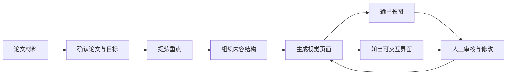

# Paper Card

把学术论文整理成适合手机阅读和分享传播的图片内容。

这个仓库的重点不是做一个“Agent 产品”，而是沉淀一套稳定的论文转译流程：从论文材料出发，经过提炼、结构化和视觉转译，最后输出长图和可交互界面。

## 这个项目是什么

- 输入：论文链接、PDF、标题、截图、笔记，或者模糊线索
- 处理：确认论文、提炼重点、组织讲解顺序、生成文案与视觉页面
- 输出：手机竖屏长图，以及对应的可交互 HTML 页面

## 工作流



## 仓库怎么读

- `README.md`
  仓库首页，说明项目目标、流程和目录结构
- `docs/project-overview.md`
  GitHub 友好的项目说明，适合快速理解这个项目如何工作
- `papers/attention-is-all-you-need/draft.md`
  某篇论文的内容初稿和讨论记录
- `papers/attention-is-all-you-need/final.html`
  最终的可交互页面
- `case-study.html`
  本地展示用的可视化 case 页面，不作为 GitHub 首页

## 当前示例

当前仓库里的案例论文是 `Attention Is All You Need`。


- 初稿：[`draft.md`](papers/attention-is-all-you-need/draft.md)
- 定稿页面：[`final.html`](papers/attention-is-all-you-need/final.html)
- 项目说明：[`docs/project-overview.md`](docs/project-overview.md)

## 目录结构

```text
paper-card/
├── README.md
├── docs/
│   └── project-overview.md
├── case-study.html
└── papers/
    └── attention-is-all-you-need/
        ├── draft.md
        ├── final.html
        ├── page-1.png
        ├── page-2.png
        └── page-3.png
```

## 协作方式

1. 提供论文材料或线索。
2. 确认目标受众和输出形式。
3. 生成初稿并讨论修改。
4. 定稿后生成 HTML 页面。
5. 从页面输出分享图片。
