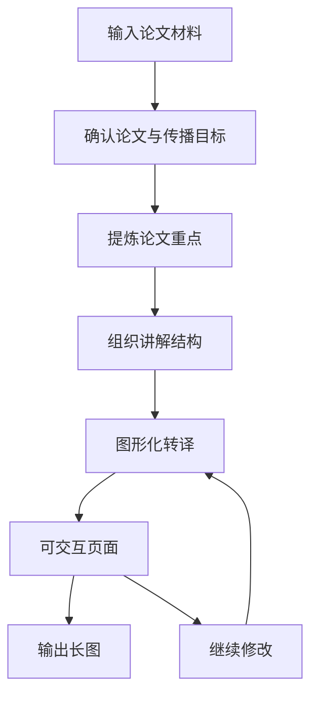
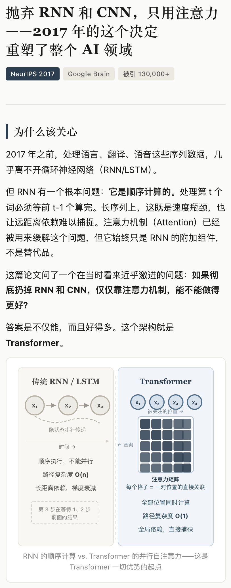

# 项目说明

`Paper Card` 是一个把论文内容转成分享图片的项目。

GitHub 上的说明应该优先回答三件事：这个项目做什么、怎么工作、最后产出什么。它不是一个单独的 Agent 产品仓库，`agent` 在这里更像协作方式，而不是最终交付物本身。

## 项目定位

- 目标：把学术论文整理成更容易讲解、传播和复看的内容
- 输入：论文链接、PDF、标题、截图、笔记或模糊线索
- 输出：长图和可交互界面
- 读者：分享课听众、设计师、研究者、需要快速理解论文的人

## 从论文到分享图片

## 核心判断

这个项目的难点不在“把论文搬到页面上”，而在下面几件事：

- 判断哪些内容值得讲
- 决定信息的先后顺序
- 把技术内容改写成更容易理解的表达
- 选择合适的视觉形式，而不是堆积图形

这也是为什么仓库里既有 `draft.md`，也有 `final.html`。一个负责内容讨论，一个负责最终交付。

## 当前仓库里的例子

`papers/attention-is-all-you-need/` 展示了一次完整流程：

1. `draft.md`
   论文内容的初稿、模块拆分和讨论重点
2. `final.html`
   整理后的可交互页面
3. `page-1.png`、`page-2.png`、`page-3.png`
   从页面输出的分享图片

## 为什么 GitHub 不直接展示网页 Case

网页 case 更适合演示、讲课和本地浏览，但 GitHub 首页更适合：

- 用简洁文字说明项目边界
- 用 Markdown 和 Mermaid 展示流程
- 让别人快速理解仓库里每个文件的角色
- 保持仓库主页稳定、轻量、可维护

所以更合适的分工是：

- `README.md`：项目首页
- `docs/project-overview.md`：项目说明
- `case-study.html`：本地展示素材
